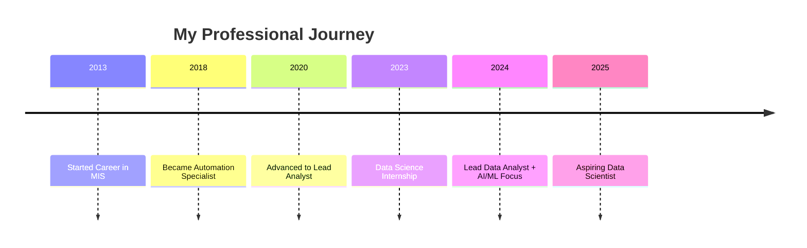

<h1 align="center">
  
</h1>

<p align="center">
  
  
  
</p>

<div align="center">
  
[](https://linkedin.com/in/ashish-pachauri-62853a143)
[](mailto:Ashish.pachauri@yahoo.com)

</div>

---


## 🚀 About Me

```python
class AshishPachauri:
    def __init__(self):
        self.name = "Ashish Pachauri"
        self.location = "Noida, India 🇮🇳"
        self.experience = "4+ Years"
        
    def current_focus(self):
        return [
            "🔬 Real-world projects in NLP, ML & DL",
            "⚙️ Automating systems with Apps Script",
            "📊 Building Predictive Models",
            "🎓 PG Program in Data Science, AI & ML"
        ]
    
    def motto(self):
        return "Automating to Elevate — Turning manual chaos into meaningful clarity ✨"
```

<br>

### 💡 Core Strengths

- 🎯 **4+ Years** of transforming manual processes into smart, automated systems
- 📈 **Lead Data Analyst** with expertise in ML, AI, Analytics & Automation
- 🤖 **Data Science Intern** experience with real-world EDA, ML, DL & NLP projects
- ⚡ Expert in **process optimization** and **data-driven decision making**

---

## 🛠️ Tech Stack & Skills

<details open>
<summary><b>🐍 Programming & Data Science</b></summary>
<br>


</details>

<details open>
<summary><b>📊 Data Visualization & BI Tools</b></summary>
<br>


</details>

<details open>
<summary><b>💾 Database & Query Languages</b></summary>
<br>


</details>

<details open>
<summary><b>⚙️ Automation & Cloud Tools</b></summary>
<br>


</details>

<details open>
<summary><b>📈 Office & Design Tools</b></summary>
<br>


</details>

<details open>
<summary><b>🔧 Other Skills</b></summary>
<br>


</details>

---

## 📊 GitHub Statistics

<div align="center">
  


</div>

<div align="center">
  


</div>

<div align="center">
  


</div>

---

## 🏆 GitHub Trophies

<div align="center">

[](https://github.com/ryo-ma/github-profile-trophy)

</div>

---

## 🚀 Featured Projects

<div align="center">

| 🎯 Project | 📝 Description | 🔧 Tech Stack | 🔗 Link |
|:-----------|:---------------|:-------------|:--------|
| **🖥️ GUI Calculator** | Interactive calculator with graphical interface | Python, Tkinter | [View](https://github.com/Ashishpachauri489/NextHikes_Project1-Calculator-.git) |
| **🧹 Data Wrangling** | Advanced data cleaning & preprocessing | Python, Pandas, NumPy | [View](https://github.com/DebasisBaidya/Data-Wrangling_Project-2) |
| **📊 EDA Project** | Comprehensive exploratory data analysis | Python, Matplotlib, Seaborn | [View](https://github.com/DebasisBaidya/EDA_Project-3) |
| **🏡 Property Price Prediction** | ML regression model for real estate | Scikit-learn, XGBoost | [View](https://github.com/DebasisBaidya/Property-Price-Prediction-Capstone_1.git) |
| **📱 Handset Prediction** | Classification model for mobile devices | ML, Feature Engineering | [View](https://github.com/DebasisBaidya/Prediction_For_Handsets-Project-4) |
| **📈 Strategic Business Acquisition** | Business analytics & decision making | EDA, Statistical Analysis | [View](https://github.com/DebasisBaidya/Strategic-Business-Acquisition_Project-5) |
| **📅 Sales Forecasting** | Time series forecasting model | ARIMA, LSTM, Prophet | [View](https://github.com/DebasisBaidya/Sales_Forecasting_Project-6) |
| **🌪️ Disaster Tweet NLP** | Natural language processing for tweets | NLP, BERT, Transformers | [View](https://github.com/DebasisBaidya/Disaster-Tweet-NLP_Project-7) |
| **💼 Job Recommendation Engine** | AI-powered job matching system | NLP, Recommendation Systems | [View](https://github.com/DebasisBaidya/job-recommendation-engine-Project-8) |
| **🛒 Amazon Reviews Sentiment** | Sentiment analysis on customer reviews | NLP, VADER, TextBlob | [View](https://github.com/DebasisBaidya/Amazon_Reviews_Sentiment-NLP) |
| **📰 LLM News Research Tool** | AI-powered news analysis tool | LangChain, OpenAI, LLMs | [View](https://github.com/DebasisBaidya/LLM-News-Research-Tool_Project-9) |
| **🩺 Custom OCR with YOLO** | Object detection & OCR on cloud | YOLO, OCR, AWS/GCP | [View](https://github.com/DebasisBaidya/Custom-OCR-with-YOLO-on-Drive_Project-10.git) |

</div>

---

## 🎯 Project Categories

<details>
<summary><b>🤖 Machine Learning Projects</b></summary>
<br>

- 🏡 **Property Price Prediction** - Regression models for real estate pricing
- 📱 **Handset Prediction** - Classification for mobile device recommendations
- 💼 **Job Recommendation Engine** - ML-based career matching system

</details>

<details>
<summary><b>🧠 Deep Learning & NLP Projects</b></summary>
<br>

- 🌪️ **Disaster Tweet Classification** - NLP model for emergency detection
- 🛒 **Amazon Sentiment Analysis** - Customer review sentiment classification
- 📰 **LLM News Research Tool** - Advanced AI-powered news analyzer
- 🩺 **Custom OCR with YOLO** - Computer vision for text extraction

</details>

<details>
<summary><b>📊 Data Analytics Projects</b></summary>
<br>

- 📈 **Sales Forecasting** - Time series prediction models
- 📊 **Exploratory Data Analysis** - Comprehensive data insights
- 🧹 **Data Wrangling** - Advanced data preprocessing techniques
- 💼 **Strategic Business Acquisition** - Business intelligence analysis

</details>

<details>
<summary><b>🛠️ Application Development</b></summary>
<br>

- 🖥️ **GUI Calculator** - Desktop application with Python Tkinter
- 🎨 **Streamlit Apps** - Interactive web applications for ML models

</details>

---

## 📈 Contribution Activity

<div align="center">


</div>

---

## 🎓 Education & Certifications

<table align="center">
<tr>
<td align="center" width="50%">

### 🎓 Education
**Post Graduate Program**  
Data Science, AI & ML  
DigiCrome

</td>
<td align="center" width="50%">

### 📜 Certifications
[View All My Certifications](https://linktr.ee/debasisbaidya)  
Click to explore my credential portfolio

</td>
</tr>
</table>

---

## 💼 Professional Journey

<div align="center">



</div>

---

## 📊 Weekly Development Breakdown

<!--START_SECTION:waka-->
<!--END_SECTION:waka-->

---

## 🌟 What I'm Currently Working On

<table align="center">
<tr>
<td align="center" width="33%">

### 🔬 Learning
- Advanced Deep Learning
- LLM Fine-tuning
- MLOps & Deployment
- Cloud Architecture

</td>
<td align="center" width="33%">

### 💻 Building
- NLP Applications
- Predictive Models
- Automation Scripts
- Data Pipelines

</td>
<td align="center" width="33%">

### 🎯 Goals
- Complete 20+ DS Projects
- Contribute to Open Source
- Build Production Models
- Share Knowledge

</td>
</tr>
</table>

---

## 💡 Random Dev Quote

<div align="center">


</div>

---

## 🐍 Contribution Snake

<div align="center">


</div>

---

## 📫 Let's Connect!

<div align="center">

I'm always open to interesting conversations and collaboration opportunities!

**💬 Reach out to discuss:**
- 🤝 Collaboration on Data Science projects
- 💼 Professional opportunities
- 🎓 Learning and knowledge sharing
- ⚡ Automation and analytics solutions

<br>

[](https://www.linkedin.com/in/debasisbaidya)
[](mailto:speak2debasis@gmail.com)
[](https://api.whatsapp.com/send?phone=918013316086&text=Hi%20Debasis!)
[](https://sites.google.com/view/debasisbaidyakolkata)

</div>

---

<div align="center">

### ⭐ From [DebasisBaidya](https://github.com/DebasisBaidya)

**"Automating to Elevate — Turning manual chaos into meaningful clarity"** ✨


</div>
